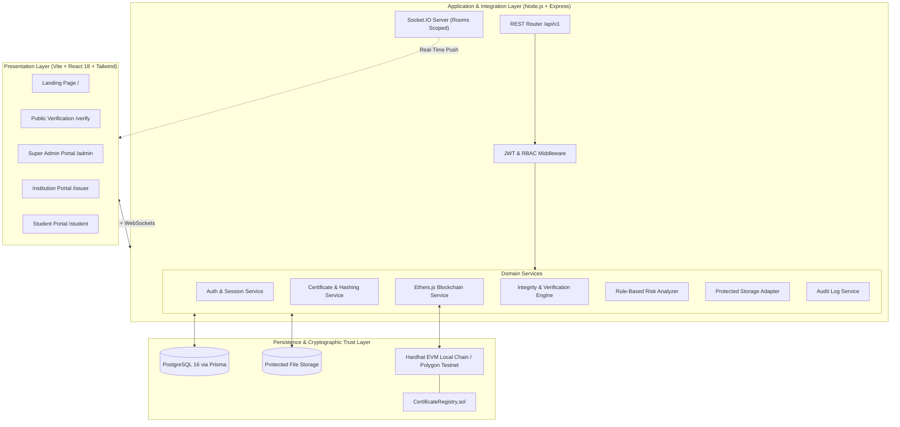
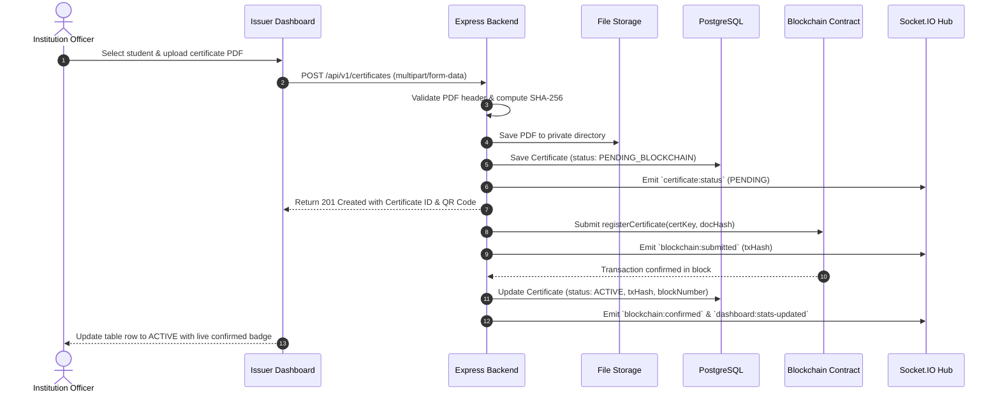
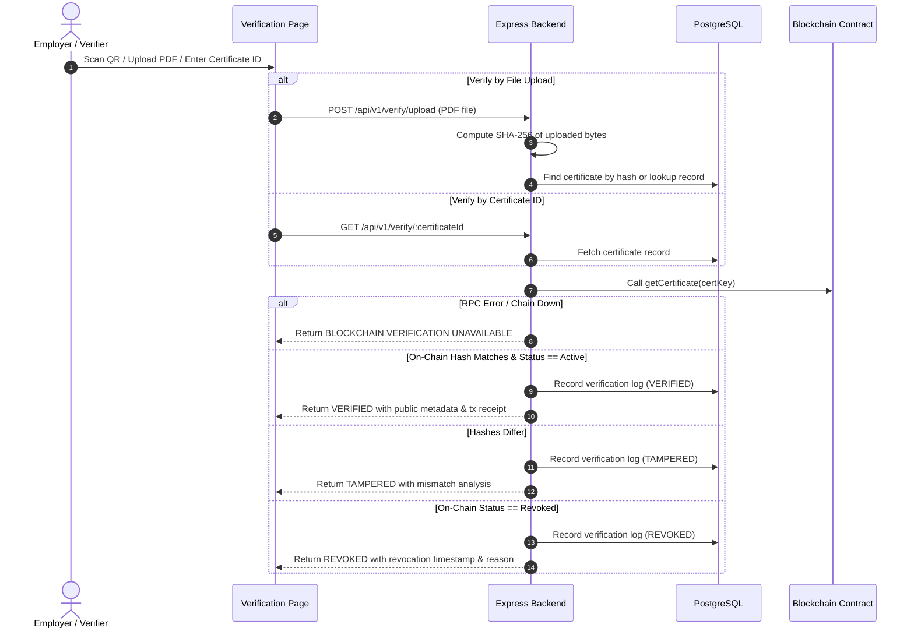

# System Architecture — CertiChain

## 1. High-Level Architecture Diagram

```mermaid
flowchart TB
    subgraph Clients["Presentation Layer (Vite + React 18 + Tailwind)"]
        Landing["Landing Page /"]
        PublicVerify["Public Verification /verify"]
        AdminDash["Super Admin Portal /admin"]
        IssuerDash["Institution Portal /issuer"]
        StudentDash["Student Portal /student"]
    end

    subgraph API["Application & Integration Layer (Node.js + Express)"]
        Router["REST Router /api/v1"]
        AuthMiddleware["JWT & RBAC Middleware"]
        SocketServer["Socket.IO Server (Rooms Scoped)"]
        
        subgraph Services["Domain Services"]
            AuthService["Auth & Session Service"]
            CertService["Certificate & Hashing Service"]
            ChainService["Ethers.js Blockchain Service"]
            VerifService["Integrity & Verification Engine"]
            FraudEngine["Rule-Based Risk Analyzer"]
            StorageAdapter["Protected Storage Adapter"]
            AuditService["Audit Log Service"]
        end
    end

    subgraph Data["Persistence & Cryptographic Trust Layer"]
        Postgres[(PostgreSQL 16 via Prisma)]
        LocalStorage[(Protected File Storage)]
        HardhatNode["Hardhat EVM Local Chain / Polygon Testnet"]
        Contract["CertificateRegistry.sol"]
    end

    Clients <-->|REST API + WebSockets| API
    Router --> AuthMiddleware
    AuthMiddleware --> Services
    Services <--> Postgres
    Services <--> LocalStorage
    ChainService <--> HardhatNode
    HardhatNode --- Contract
    SocketServer -.->|Real-Time Push| Clients
```

---

## 2. End-to-End Issuance Workflow

```mermaid
sequenceDiagram
    autonumber
    actor Issuer as Institution Officer
    participant UI as Issuer Dashboard
    participant API as Express Backend
    participant Storage as File Storage
    participant DB as PostgreSQL
    participant Chain as Blockchain Contract
    participant Sockets as Socket.IO Hub
    
    Issuer->>UI: Select student & upload certificate PDF
    UI->>API: POST /api/v1/certificates (multipart/form-data)
    API->>API: Validate PDF header & compute SHA-256
    API->>Storage: Save PDF to private directory
    API->>DB: Save Certificate (status: PENDING_BLOCKCHAIN)
    API->>Sockets: Emit `certificate:status` (PENDING)
    API-->>UI: Return 201 Created with Certificate ID & QR Code
    
    API->>Chain: Submit registerCertificate(certKey, docHash)
    API->>Sockets: Emit `blockchain:submitted` (txHash)
    Chain-->>API: Transaction confirmed in block
    API->>DB: Update Certificate (status: ACTIVE, txHash, blockNumber)
    API->>Sockets: Emit `blockchain:confirmed` & `dashboard:stats-updated`
    UI-->>Issuer: Update table row to ACTIVE with live confirmed badge
```

---

## 3. End-to-End Verification Workflow

```mermaid
sequenceDiagram
    autonumber
    actor Verifier as Employer / Verifier
    participant VerifyUI as Verification Page
    participant API as Express Backend
    participant DB as PostgreSQL
    participant Chain as Blockchain Contract
    
    Verifier->>VerifyUI: Scan QR / Upload PDF / Enter Certificate ID
    alt Verify by File Upload
        VerifyUI->>API: POST /api/v1/verify/upload (PDF file)
        API->>API: Compute SHA-256 of uploaded bytes
        API->>DB: Find certificate by hash or lookup record
    else Verify by Certificate ID
        VerifyUI->>API: GET /api/v1/verify/:certificateId
        API->>DB: Fetch certificate record
    end
    
    API->>Chain: Call getCertificate(certKey)
    alt RPC Error / Chain Down
        API-->>VerifyUI: Return BLOCKCHAIN VERIFICATION UNAVAILABLE
    else On-Chain Hash Matches & Status == Active
        API->>DB: Record verification log (VERIFIED)
        API-->>VerifyUI: Return VERIFIED with public metadata & tx receipt
    else Hashes Differ
        API->>DB: Record verification log (TAMPERED)
        API-->>VerifyUI: Return TAMPERED with mismatch analysis
    else On-Chain Status == Revoked
        API->>DB: Record verification log (REVOKED)
        API-->>VerifyUI: Return REVOKED with revocation timestamp & reason
    end
```
